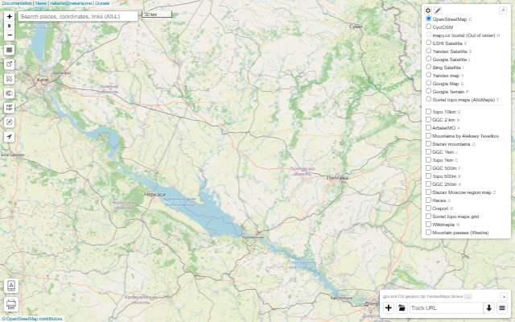
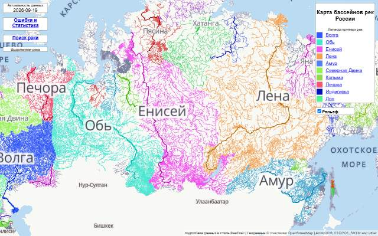
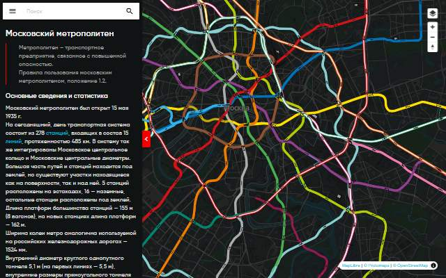
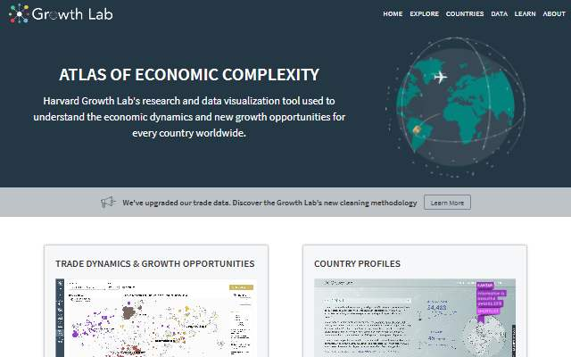
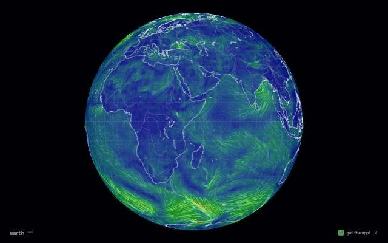
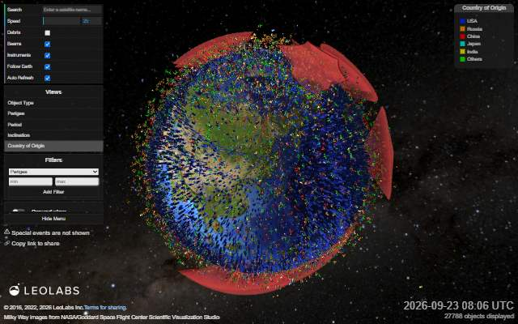
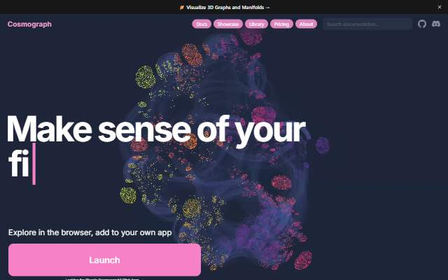

# Awesome Maps & Visualizations

A curated collection of maps, data stories, and visual experiments — with compact previews and last-available dates.

**88 links · 9 categories** · **Checked 2026-09-23**

[Browse the text index](catalog/index.md) · [Suggest a link](CONTRIBUTING.md) · [How to maintain this collection](MAINTAINING.md)

## Explore

<table>
<tr>
<td width="33%" valign="top" align="center">
 
<strong><a href="catalog/interactive-maps-and-cartography.md">Maps &amp; Cartography</a></strong> 9 entries

Projections, unusual perspectives and useful ways to explore a map.

</td>
<td width="33%" valign="top" align="center">
 
<strong><a href="catalog/geodata-and-portals.md">Data &amp; Geoportals</a></strong> 9 entries

Open datasets, geographic portals and tools for discovering places.

</td>
<td width="33%" valign="top" align="center">
 
<strong><a href="catalog/transport-and-mobility.md">Transport &amp; Mobility</a></strong> 11 entries

Aircraft, ships, trains and the infrastructure connecting the world.

</td>
</tr>
<tr>
<td width="33%" valign="top" align="center">
 
<strong><a href="catalog/history-and-heritage.md">History &amp; Heritage</a></strong> 20 entries

Historical maps, visual timelines, archives and cultural collections.

</td>
<td width="33%" valign="top" align="center">
 
<strong><a href="catalog/society-culture-and-data-stories.md">Society &amp; Culture</a></strong> 13 entries

Visual stories about society, language, economics and everyday life.

</td>
<td width="33%" valign="top" align="center">
 
<strong><a href="catalog/weather-nature-and-earth.md">Nature &amp; Weather</a></strong> 6 entries

Weather, wildlife, air quality and the changing natural world.

</td>
</tr>
<tr>
<td width="33%" valign="top" align="center">
 
<strong><a href="catalog/space.md">Space &amp; Scale</a></strong> 8 entries

Stars, satellites and visual journeys through the universe.

</td>
<td width="33%" valign="top" align="center">
 
<strong><a href="catalog/virtual-exploration.md">Virtual Exploration</a></strong> 5 entries

Panoramas, city walks, radio stations and windows onto other places.

</td>
<td width="33%" valign="top" align="center">
 
<strong><a href="catalog/tools-and-experiments.md">Tools &amp; Experiments</a></strong> 7 entries

Creative tools, network visualizations and cartographic experiments.

</td>
</tr>
</table>

## Availability

🟢 **Last available: YYYY-MM-DD** is the most recent date on which the saved URL returned a successful response. It is a dated observation, not a live uptime indicator or a guarantee that every interactive feature works. Entries without a successful check show **Not verified yet**.

The last successful date is preserved until a newer successful check replaces it. Screenshots are separate snapshots; a labeled placeholder is used when no usable preview is available. Hover over a preview to see its capture date.

Checks run once a month through GitHub Actions after the repository is published. See [maintenance instructions](MAINTAINING.md) to refresh availability dates or previews locally.

## About this collection

Maps sit alongside charts, simulations, photographs and illustrated stories. Each entry has a topic (its category), a format and a source-language label: **EN**, **RU** or **Multilingual**. Small UK/Russian flags accompany EN/RU as visual cues for language, not the origin of a project; multilingual sources use a globe. Historical material may use a specific language code, such as **LA** for Latin, without a national flag. Descriptions are in English; linked websites keep their original languages.

Previews link to the original work. Screenshots and linked content remain the work of their respective creators.
