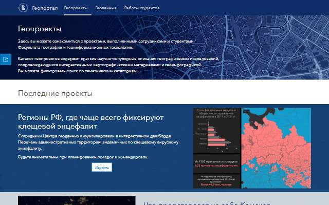
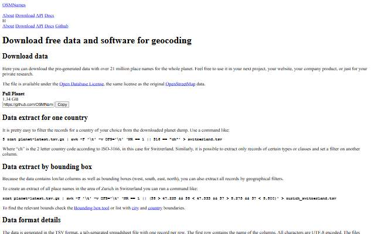
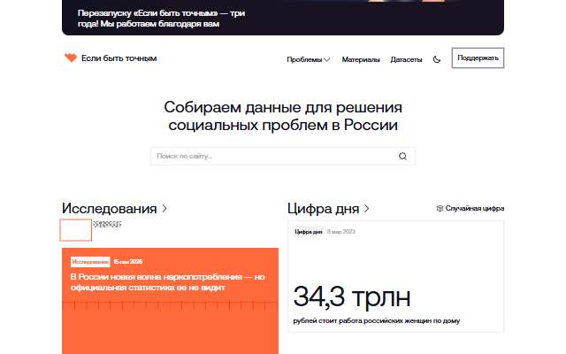
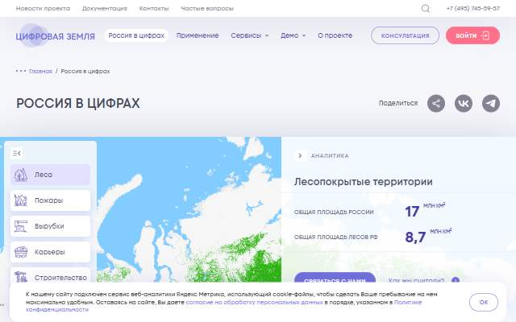
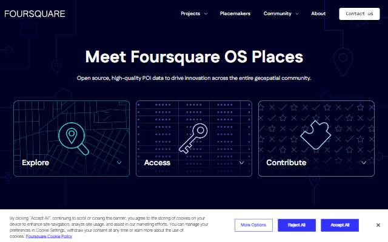
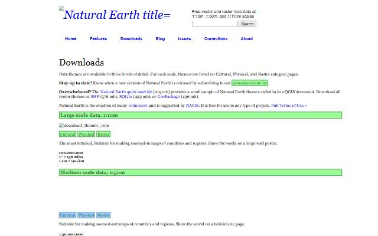
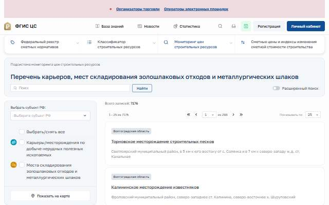

[← All categories](../README.md) · [Text index](index.md) · [About status dates](../README.md#availability)

# Data & Geoportals

Open datasets, geographic portals and tools for discovering places.

**9 entries** · Click a preview or title to open the original.

Compact text view · useful on small screens

- [HSE Geodata Projects](<https://geoportal.hse.ru/portal/apps/sites/#/geodata/pages/geoprojects>) — Research projects and geospatial resources from HSE University. *Collection · RU · Last available: 2026-09-23*
- [Russian River Basins](<https://frexosm.ru/basin/>) — Explore Russia's drainage basins and river networks. *Map · RU · Last available: 2026-09-23*
- [OSMNames](<http://osmnames.org/download/>) — Download place names and geographic search data based on OpenStreetMap. *Dataset · EN · Last available: 2026-09-23*
- [WebCensus · Data](<http://webcensus.ru/%d0%b4%d0%b0%d0%bd%d0%bd%d1%8b%d0%b5/>) — Population data from the Virtual Population of Russia project. *Dataset · RU · Not verified yet*
- [To Be Precise](<https://tochno.st/>) — Data and research about social issues across Russian regions. *Dataset · RU · Last available: 2026-09-23*
- [Russia in Numbers](<https://dgearth.ru/russia/>) — Explore Russian regional statistics through a geographic interface. *Visualization · RU · Last available: 2026-09-23*
- [Foursquare OS Places](<https://opensource.foursquare.com/os-places/>) — Open point-of-interest data for mapping and spatial analysis. *Dataset · EN · Last available: 2026-09-23*
- [Natural Earth](<https://www.naturalearthdata.com/downloads/>) — Free vector and raster basemap data at several map scales. *Dataset · EN · Last available: 2026-09-23*
- [Construction Materials Map](<https://fgiscs.minstroyrf.ru/monitoring/quarries>) — Quarries and construction-material sources in the FGIS CS portal. *Dataset · RU · Last available: 2026-09-23*

<table>
<tr>
<td width="33%" valign="top" align="center">
 
<strong><a href="https://geoportal.hse.ru/portal/apps/sites/#/geodata/pages/geoprojects">HSE Geodata Projects</a></strong> 
Collection · &nbsp;RU

Research projects and geospatial resources from HSE University.

🟢 Last available: 2026-09-23
</td>
<td width="33%" valign="top" align="center">
 
<strong><a href="https://frexosm.ru/basin/">Russian River Basins</a></strong> 
Map · &nbsp;RU

Explore Russia&#39;s drainage basins and river networks.

🟢 Last available: 2026-09-23
</td>
<td width="33%" valign="top" align="center">
 
<strong><a href="http://osmnames.org/download/">OSMNames</a></strong> 
Dataset · &nbsp;EN

Download place names and geographic search data based on OpenStreetMap.

🟢 Last available: 2026-09-23
</td>
</tr>
<tr>
<td width="33%" valign="top" align="center">
 
<strong><a href="http://webcensus.ru/%d0%b4%d0%b0%d0%bd%d0%bd%d1%8b%d0%b5/">WebCensus · Data</a></strong> 
Dataset · &nbsp;RU

Population data from the Virtual Population of Russia project.

⚪ Not verified yet
</td>
<td width="33%" valign="top" align="center">
 
<strong><a href="https://tochno.st/">To Be Precise</a></strong> 
Dataset · &nbsp;RU

Data and research about social issues across Russian regions.

🟢 Last available: 2026-09-23
</td>
<td width="33%" valign="top" align="center">
 
<strong><a href="https://dgearth.ru/russia/">Russia in Numbers</a></strong> 
Visualization · &nbsp;RU

Explore Russian regional statistics through a geographic interface.

🟢 Last available: 2026-09-23
</td>
</tr>
<tr>
<td width="33%" valign="top" align="center">
 
<strong><a href="https://opensource.foursquare.com/os-places/">Foursquare OS Places</a></strong> 
Dataset · &nbsp;EN

Open point-of-interest data for mapping and spatial analysis.

🟢 Last available: 2026-09-23
</td>
<td width="33%" valign="top" align="center">
 
<strong><a href="https://www.naturalearthdata.com/downloads/">Natural Earth</a></strong> 
Dataset · &nbsp;EN

Free vector and raster basemap data at several map scales.

🟢 Last available: 2026-09-23
</td>
<td width="33%" valign="top" align="center">
 
<strong><a href="https://fgiscs.minstroyrf.ru/monitoring/quarries">Construction Materials Map</a></strong> 
Dataset · &nbsp;RU

Quarries and construction-material sources in the FGIS CS portal.

🟢 Last available: 2026-09-23
</td>
</tr>
</table>

[↑ All categories](../README.md)
