[← All categories](../README.md) · [Text index](index.md) · [About status dates](../README.md#availability)

# History & Heritage

Historical maps, visual timelines, archives and cultural collections.

**20 entries** · Click a preview or title to open the original.

Compact text view · useful on small screens

- [Building Ages in Russia](<https://basemap.ru/age/>) — Discover when buildings were constructed through a city map. *Map · RU · Last available: 2026-09-23*
- [Russia's Borders, 1462–2018](<https://map.runivers.ru/>) — Explore how Russia's borders changed over time. *Map · RU · Not verified yet*
- [Russia in Photographs](<https://russiainphoto.ru/>) — Search an archive of historical photographs of Russia. *Collection · RU · Last available: 2026-09-23*
- [Retromap](<http://www.retromap.ru/>) — Explore historical maps of Russian cities and other places. *Map · RU · Last available: 2026-09-23*
- [An Atlas of the Vikings](<http://rigea.maps.arcgis.com/apps/MapJournal/index.html?appid=b7810b4c1e4a4ffcb3049559ddc70b27>) — A map-based journey through Viking history. *Visualization · EN · Last available: 2026-09-23*
- [Ancient Earth](<https://dinosaurpictures.org/ancient-earth>) — See how continents and familiar places moved through geological time. *Map · EN · Last available: 2026-09-23*
- [A History of Battles](<http://battles.nodegoat.net/viewer.p/23/385/scenario/1/geo/fullscreen>) — Explore historical battles through Nodegoat's geographic viewer. *Map · EN · Last available: 2026-09-23*
- [Carta Marina](<http://upload.wikimedia.org/wikipedia/commons/e/ea/Carta_Marina.jpeg>) — A high-resolution image of the illustrated historical map. *Map · LA · Last available: 2026-09-23*
- [David Rumsey Map Collection](<https://www.davidrumsey.com/>) — Browse a large collection of historical maps and atlases. *Collection · EN · Last available: 2026-09-23*
- [How Old Is This House?](<https://how-old-is-this.house/>) — Explore the ages of buildings in Saint Petersburg. *Map · RU · Last available: 2026-09-23*
- [Point in History](<https://hanshack.com/point-in-history/>) — A visual exploration of historical places by Hans Hack. *Map · EN · Last available: 2026-09-23*
- [The History of Europe](<http://hrono.ru/proekty/ostu/europe.html>) — Historical reference material about Europe's changing geography. *Article · RU · Last available: 2026-09-23*
- [TimeMap](<https://www.oldmapsonline.org/en/history/people>) — Explore historical people and places on a map with a timeline. *Map · Multilingual · Not verified yet*
- [Moscow's Changing Borders](<https://dev.kartfak.ru/bndmoscow/>) — Trace the expansion of Moscow through historical boundaries. *Map · RU · Last available: 2026-09-23*
- [Calculating Empires](<https://calculatingempires.net/>) — A visual genealogy of technology and power across five centuries. *Timeline · EN · Last available: 2026-09-23*
- [Historical Exhibition Poster](<http://www.krasnoyeznamya.ru/picm.php?vrub=rm&pid=17&picid=99>) — A saved poster for an international brewing and machinery exhibition. *Image · RU · Not verified yet*
- [Nalichniki](<http://nalichniki.com/>) — A photographic collection of traditional carved wooden window frames. *Collection · RU · Last available: 2026-09-23*
- [NYPL Digital Collections](<http://digitalcollections.nypl.org/>) — Explore digitized photographs, maps, prints and historical materials. *Collection · EN · Last available: 2026-09-23*
- [Prokudin-Gorsky · Virtual Museum](<https://3dplatforma.ru/prokudingorsky>) — A virtual exhibition dedicated to Prokudin-Gorsky's photography. *Virtual Tour · RU · Last available: 2026-09-23*
- [Pax Historia](<https://www.paxhistoria.co/>) — Explore alternative history through a map-based strategy experience. *Simulation · EN · Last available: 2026-09-23*

<table>
<tr>
<td width="33%" valign="top" align="center">
 
<strong><a href="https://basemap.ru/age/">Building Ages in Russia</a></strong> 
Map · &nbsp;RU

Discover when buildings were constructed through a city map.

🟢 Last available: 2026-09-23
</td>
<td width="33%" valign="top" align="center">
 
<strong><a href="https://map.runivers.ru/">Russia&#39;s Borders, 1462–2018</a></strong> 
Map · &nbsp;RU

Explore how Russia&#39;s borders changed over time.

⚪ Not verified yet
</td>
<td width="33%" valign="top" align="center">
 
<strong><a href="https://russiainphoto.ru/">Russia in Photographs</a></strong> 
Collection · &nbsp;RU

Search an archive of historical photographs of Russia.

🟢 Last available: 2026-09-23
</td>
</tr>
<tr>
<td width="33%" valign="top" align="center">
<a href="http://www.retromap.ru/">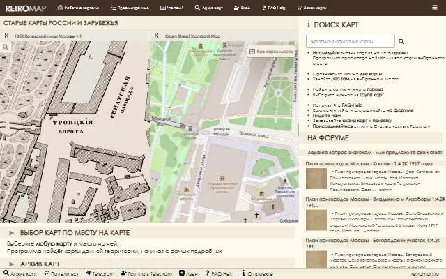</a> 
<strong><a href="http://www.retromap.ru/">Retromap</a></strong> 
Map · &nbsp;RU

Explore historical maps of Russian cities and other places.

🟢 Last available: 2026-09-23
</td>
<td width="33%" valign="top" align="center">
 
<strong><a href="http://rigea.maps.arcgis.com/apps/MapJournal/index.html?appid=b7810b4c1e4a4ffcb3049559ddc70b27">An Atlas of the Vikings</a></strong> 
Visualization · &nbsp;EN

A map-based journey through Viking history.

🟢 Last available: 2026-09-23
</td>
<td width="33%" valign="top" align="center">
<a href="https://dinosaurpictures.org/ancient-earth">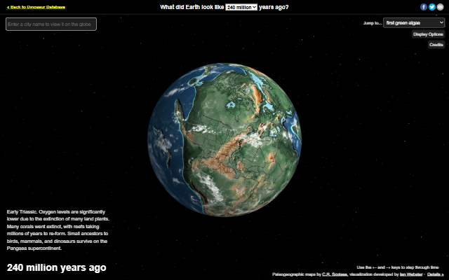</a> 
<strong><a href="https://dinosaurpictures.org/ancient-earth">Ancient Earth</a></strong> 
Map · &nbsp;EN

See how continents and familiar places moved through geological time.

🟢 Last available: 2026-09-23
</td>
</tr>
<tr>
<td width="33%" valign="top" align="center">
<a href="http://battles.nodegoat.net/viewer.p/23/385/scenario/1/geo/fullscreen">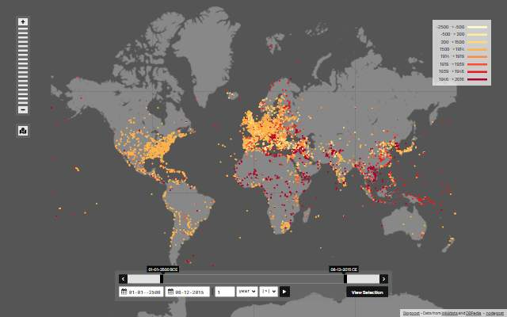</a> 
<strong><a href="http://battles.nodegoat.net/viewer.p/23/385/scenario/1/geo/fullscreen">A History of Battles</a></strong> 
Map · &nbsp;EN

Explore historical battles through Nodegoat&#39;s geographic viewer.

🟢 Last available: 2026-09-23
</td>
<td width="33%" valign="top" align="center">
<a href="http://upload.wikimedia.org/wikipedia/commons/e/ea/Carta_Marina.jpeg">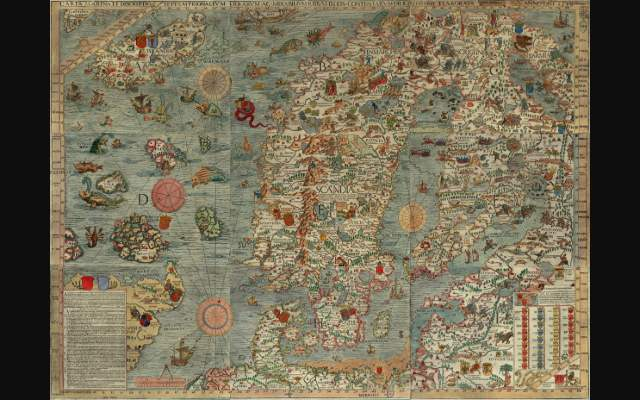</a> 
<strong><a href="http://upload.wikimedia.org/wikipedia/commons/e/ea/Carta_Marina.jpeg">Carta Marina</a></strong> 
Map · LA

A high-resolution image of the illustrated historical map.

🟢 Last available: 2026-09-23
</td>
<td width="33%" valign="top" align="center">
<a href="https://www.davidrumsey.com/">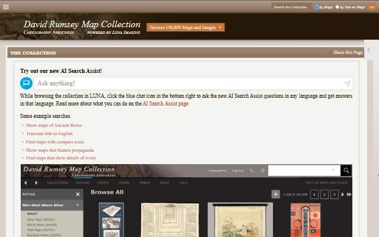</a> 
<strong><a href="https://www.davidrumsey.com/">David Rumsey Map Collection</a></strong> 
Collection · &nbsp;EN

Browse a large collection of historical maps and atlases.

🟢 Last available: 2026-09-23
</td>
</tr>
<tr>
<td width="33%" valign="top" align="center">
 
<strong><a href="https://how-old-is-this.house/">How Old Is This House?</a></strong> 
Map · &nbsp;RU

Explore the ages of buildings in Saint Petersburg.

🟢 Last available: 2026-09-23
</td>
<td width="33%" valign="top" align="center">
<a href="https://hanshack.com/point-in-history/">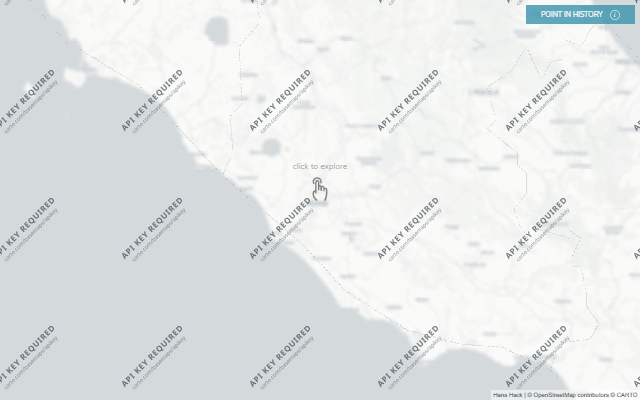</a> 
<strong><a href="https://hanshack.com/point-in-history/">Point in History</a></strong> 
Map · &nbsp;EN

A visual exploration of historical places by Hans Hack.

🟢 Last available: 2026-09-23
</td>
<td width="33%" valign="top" align="center">
<a href="http://hrono.ru/proekty/ostu/europe.html">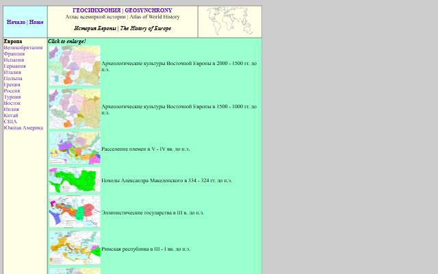</a> 
<strong><a href="http://hrono.ru/proekty/ostu/europe.html">The History of Europe</a></strong> 
Article · &nbsp;RU

Historical reference material about Europe&#39;s changing geography.

🟢 Last available: 2026-09-23
</td>
</tr>
<tr>
<td width="33%" valign="top" align="center">
 
<strong><a href="https://www.oldmapsonline.org/en/history/people">TimeMap</a></strong> 
Map · &nbsp;Multilingual

Explore historical people and places on a map with a timeline.

⚪ Not verified yet
</td>
<td width="33%" valign="top" align="center">
<a href="https://dev.kartfak.ru/bndmoscow/">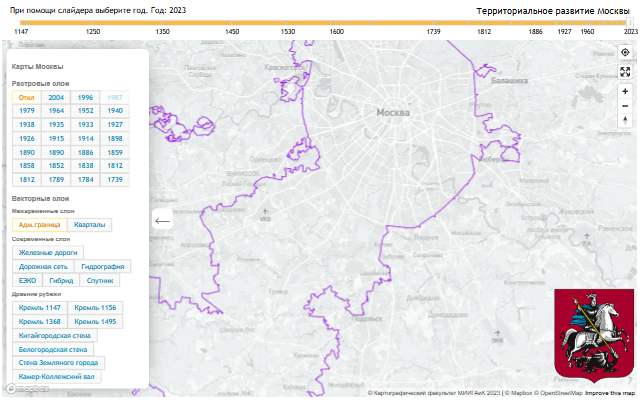</a> 
<strong><a href="https://dev.kartfak.ru/bndmoscow/">Moscow&#39;s Changing Borders</a></strong> 
Map · &nbsp;RU

Trace the expansion of Moscow through historical boundaries.

🟢 Last available: 2026-09-23
</td>
<td width="33%" valign="top" align="center">
<a href="https://calculatingempires.net/">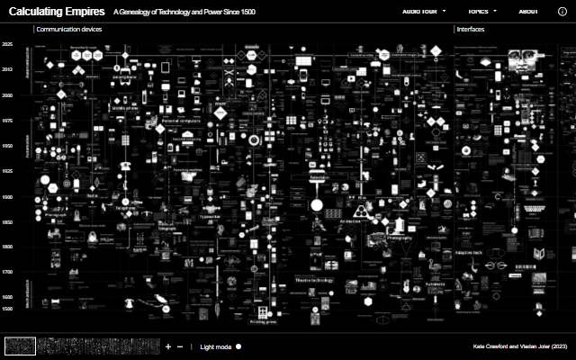</a> 
<strong><a href="https://calculatingempires.net/">Calculating Empires</a></strong> 
Timeline · &nbsp;EN

A visual genealogy of technology and power across five centuries.

🟢 Last available: 2026-09-23
</td>
</tr>
<tr>
<td width="33%" valign="top" align="center">
 
<strong><a href="http://www.krasnoyeznamya.ru/picm.php?vrub=rm&amp;pid=17&amp;picid=99">Historical Exhibition Poster</a></strong> 
Image · &nbsp;RU

A saved poster for an international brewing and machinery exhibition.

⚪ Not verified yet
</td>
<td width="33%" valign="top" align="center">
<a href="http://nalichniki.com/">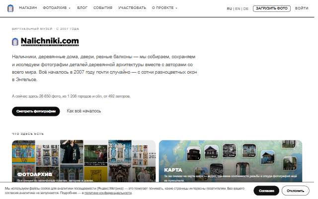</a> 
<strong><a href="http://nalichniki.com/">Nalichniki</a></strong> 
Collection · &nbsp;RU

A photographic collection of traditional carved wooden window frames.

🟢 Last available: 2026-09-23
</td>
<td width="33%" valign="top" align="center">
<a href="http://digitalcollections.nypl.org/">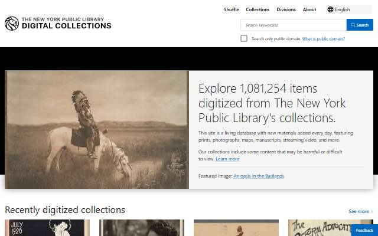</a> 
<strong><a href="http://digitalcollections.nypl.org/">NYPL Digital Collections</a></strong> 
Collection · &nbsp;EN

Explore digitized photographs, maps, prints and historical materials.

🟢 Last available: 2026-09-23
</td>
</tr>
<tr>
<td width="33%" valign="top" align="center">
<a href="https://3dplatforma.ru/prokudingorsky">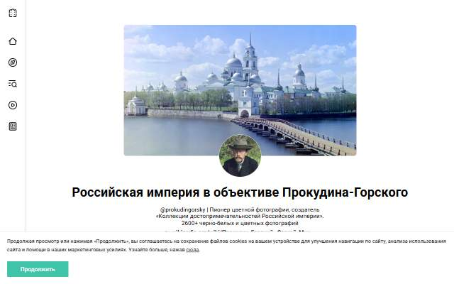</a> 
<strong><a href="https://3dplatforma.ru/prokudingorsky">Prokudin-Gorsky · Virtual Museum</a></strong> 
Virtual Tour · &nbsp;RU

A virtual exhibition dedicated to Prokudin-Gorsky&#39;s photography.

🟢 Last available: 2026-09-23
</td>
<td width="33%" valign="top" align="center">
 
<strong><a href="https://www.paxhistoria.co/">Pax Historia</a></strong> 
Simulation · &nbsp;EN

Explore alternative history through a map-based strategy experience.

🟢 Last available: 2026-09-23
</td>
<td width="33%"></td>
</tr>
</table>

[↑ All categories](../README.md) · [Licensing and third-party notices](../LICENSE.md)
