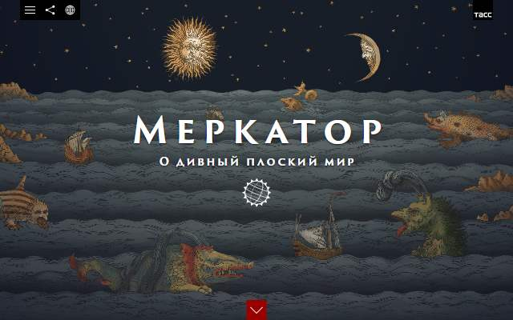
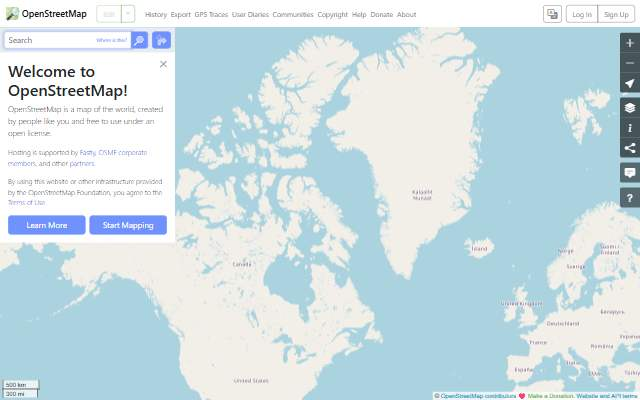
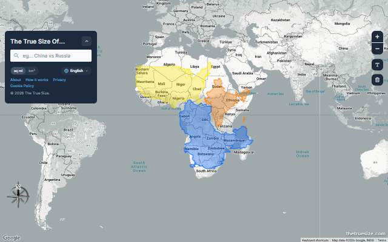
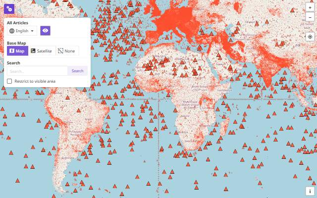
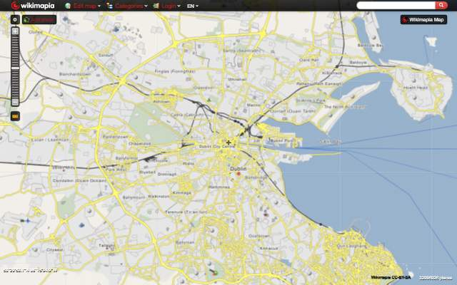
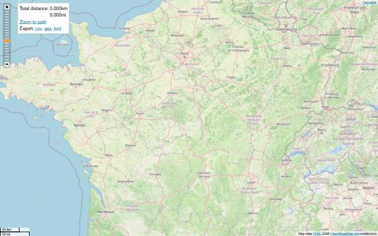

[← All categories](../README.md) · [Text index](index.md) · [About status dates](../README.md#availability)

# Maps & Cartography

Projections, unusual perspectives and useful ways to explore a map.

**9 entries** · Click a preview or title to open the original.

Compact text view · useful on small screens

- [Mercator: A Brave Flat World](<https://merkator.tass.ru/>) — A visual story about maps, projections and how we picture the world. *Visualization · RU · Last available: 2026-09-23*
- [OpenStreetMap](<http://www.openstreetmap.org/>) — Explore the world through an open, community-built map. *Map · Multilingual · Last available: 2026-09-23*
- [The True Size Of](<https://thetruesize.com/>) — Drag countries across the globe to compare their true size. *Map · EN · Last available: 2026-09-23*
- [Wikimap](<https://wikimap.wiki/>) — Browse Wikipedia articles by their location on a world map. *Map · Multilingual · Last available: 2026-09-23*
- [Wikimapia](<https://wikimapia.org/>) — Explore places and local knowledge contributed by the community. *Map · Multilingual · Last available: 2026-09-23*
- [Distance Calculator](<https://map.meurisse.org/>) — Draw a route on the map and measure the distance between points. *Tool · EN · Last available: 2026-09-23*
- [Sit in Shade](<https://sitinshade.com/>) — Find the shadier side of a vehicle for your next journey. *Tool · EN · Last available: 2026-09-23*
- [Nakarte](<https://nakarte.me/>) — Explore topographic maps, compare map layers and plan routes. *Map · Multilingual · Last available: 2026-09-23*
- [Strava Global Heatmap](<https://labs.strava.com/heatmap/>) — See where people run, ride and explore through aggregated activity. *Map · Multilingual · Last available: 2026-09-23*

<table>
<tr>
<td width="33%" valign="top" align="center">
 
<strong><a href="https://merkator.tass.ru/">Mercator: A Brave Flat World</a></strong> 
Visualization · &nbsp;RU

A visual story about maps, projections and how we picture the world.

🟢 Last available: 2026-09-23
</td>
<td width="33%" valign="top" align="center">
 
<strong><a href="http://www.openstreetmap.org/">OpenStreetMap</a></strong> 
Map · &nbsp;Multilingual

Explore the world through an open, community-built map.

🟢 Last available: 2026-09-23
</td>
<td width="33%" valign="top" align="center">
 
<strong><a href="https://thetruesize.com/">The True Size Of</a></strong> 
Map · &nbsp;EN

Drag countries across the globe to compare their true size.

🟢 Last available: 2026-09-23
</td>
</tr>
<tr>
<td width="33%" valign="top" align="center">
 
<strong><a href="https://wikimap.wiki/">Wikimap</a></strong> 
Map · &nbsp;Multilingual

Browse Wikipedia articles by their location on a world map.

🟢 Last available: 2026-09-23
</td>
<td width="33%" valign="top" align="center">
 
<strong><a href="https://wikimapia.org/">Wikimapia</a></strong> 
Map · &nbsp;Multilingual

Explore places and local knowledge contributed by the community.

🟢 Last available: 2026-09-23
</td>
<td width="33%" valign="top" align="center">
 
<strong><a href="https://map.meurisse.org/">Distance Calculator</a></strong> 
Tool · &nbsp;EN

Draw a route on the map and measure the distance between points.

🟢 Last available: 2026-09-23
</td>
</tr>
<tr>
<td width="33%" valign="top" align="center">
 
<strong><a href="https://sitinshade.com/">Sit in Shade</a></strong> 
Tool · &nbsp;EN

Find the shadier side of a vehicle for your next journey.

🟢 Last available: 2026-09-23
</td>
<td width="33%" valign="top" align="center">
 
<strong><a href="https://nakarte.me/">Nakarte</a></strong> 
Map · &nbsp;Multilingual

Explore topographic maps, compare map layers and plan routes.

🟢 Last available: 2026-09-23
</td>
<td width="33%" valign="top" align="center">
 
<strong><a href="https://labs.strava.com/heatmap/">Strava Global Heatmap</a></strong> 
Map · &nbsp;Multilingual

See where people run, ride and explore through aggregated activity.

🟢 Last available: 2026-09-23
</td>
</tr>
</table>

[↑ All categories](../README.md)
