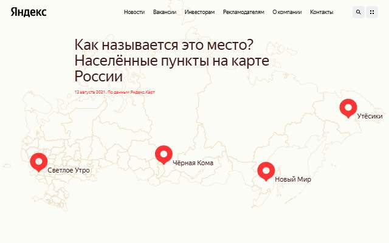
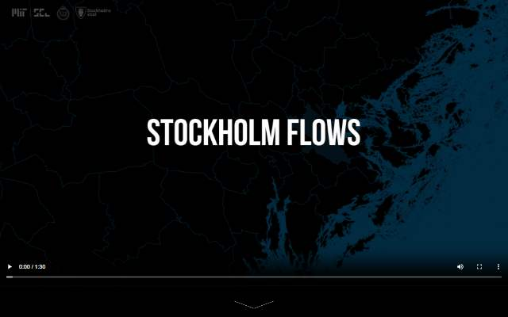
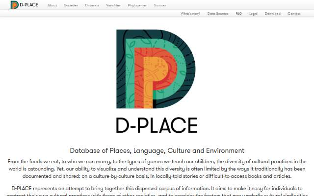
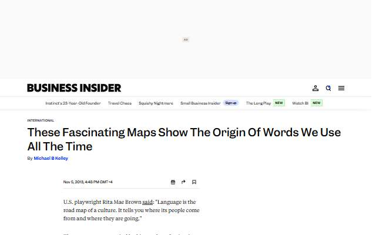
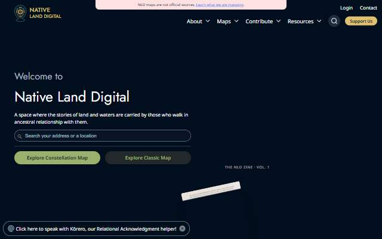
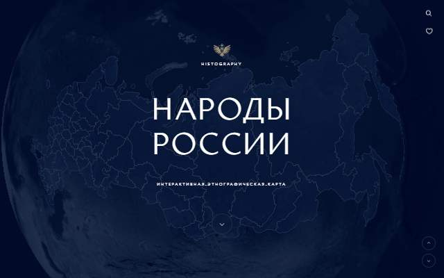
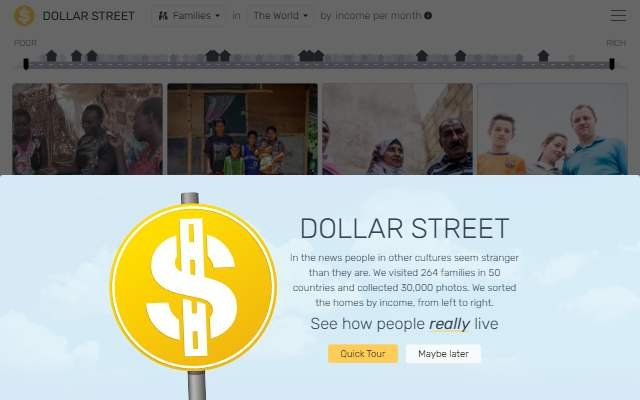
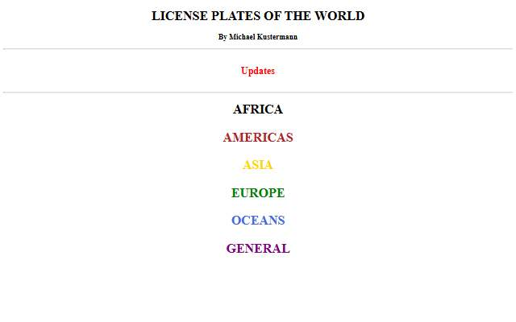
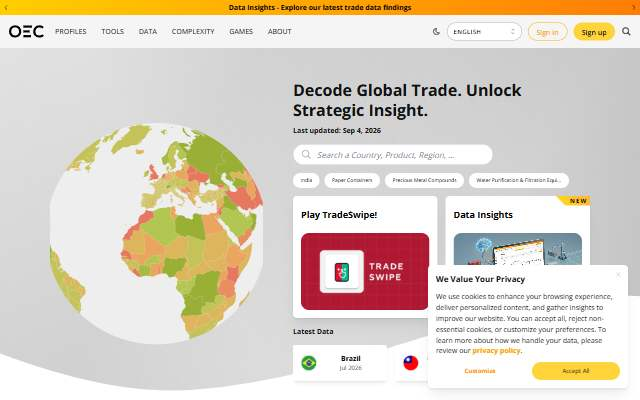

[← All categories](../README.md) · [Text index](index.md) · [About status dates](../README.md#availability)

# Society & Culture

Visual stories about society, language, economics and everyday life.

**13 entries** · Click a preview or title to open the original.

Compact text view · useful on small screens

- [Russian Place Names](<https://yandex.ru/company/researches/2021/oikonyms>) — Yandex's visual exploration of the names of Russian settlements. *Visualization · RU · Last available: 2026-09-23*
- [Stockholm Flows](<https://senseable.mit.edu/stockholm-flows/>) — MIT Senseable City Lab's visualization of movement in Stockholm. *Visualization · EN · Last available: 2026-09-23*
- [D-PLACE](<https://d-place.org/>) — Explore cultural, linguistic and environmental data about societies. *Dataset · EN · Last available: 2026-09-23*
- [The Geography of Words](<http://www.businessinsider.com/european-maps-showing-origins-of-common-words-2013-11>) — Illustrated maps of the origins of common European words. *Article · EN · Last available: 2026-09-23*
- [Native Land Digital](<https://native-land.ca/>) — Explore Indigenous territories, languages and treaties. *Map · Multilingual · Last available: 2026-09-23*
- [Peoples of Russia](<https://ethno.histography.ru/>) — An interactive map of the peoples and cultures of Russia. *Map · RU · Last available: 2026-09-23*
- [A Day in the Life of Americans](<https://flowingdata.com/2015/12/15/a-day-in-the-life-of-americans/>) — An animated simulation of how 1,000 Americans spend their day. *Visualization · EN · Not verified yet*
- [Dollar Street](<https://www.gapminder.org/dollar-street/matrix>) — Compare everyday homes and possessions across income levels. *Visualization · Multilingual · Last available: 2026-09-23*
- [Ethnologue](<http://www.ethnologue.com/>) — Explore information about the world's languages. *Dataset · EN · Not verified yet*
- [License Plates of the World](<http://www.worldlicenseplates.com/hp.html>) — A visual reference to vehicle registration plates around the world. *Collection · EN · Last available: 2026-09-23*
- [Economic Complexity Observatory](<https://oec.world/en/>) — Visualize trade flows, products and economic relationships. *Visualization · Multilingual · Last available: 2026-09-23*
- [Atlas of Economic Complexity](<https://atlas.cid.harvard.edu/>) — Explore countries' exports and economic capabilities. *Visualization · EN · Last available: 2026-09-23*
- [Your Mythical Neighbor](<https://sosedi.tigers.family/>) — Explore the magical creatures and folklore of Russia. *Visualization · RU · Last available: 2026-09-23*

<table>
<tr>
<td width="33%" valign="top" align="center">
 
<strong><a href="https://yandex.ru/company/researches/2021/oikonyms">Russian Place Names</a></strong> 
Visualization · &nbsp;RU

Yandex&#39;s visual exploration of the names of Russian settlements.

🟢 Last available: 2026-09-23
</td>
<td width="33%" valign="top" align="center">
 
<strong><a href="https://senseable.mit.edu/stockholm-flows/">Stockholm Flows</a></strong> 
Visualization · &nbsp;EN

MIT Senseable City Lab&#39;s visualization of movement in Stockholm.

🟢 Last available: 2026-09-23
</td>
<td width="33%" valign="top" align="center">
 
<strong><a href="https://d-place.org/">D-PLACE</a></strong> 
Dataset · &nbsp;EN

Explore cultural, linguistic and environmental data about societies.

🟢 Last available: 2026-09-23
</td>
</tr>
<tr>
<td width="33%" valign="top" align="center">
 
<strong><a href="http://www.businessinsider.com/european-maps-showing-origins-of-common-words-2013-11">The Geography of Words</a></strong> 
Article · &nbsp;EN

Illustrated maps of the origins of common European words.

🟢 Last available: 2026-09-23
</td>
<td width="33%" valign="top" align="center">
 
<strong><a href="https://native-land.ca/">Native Land Digital</a></strong> 
Map · &nbsp;Multilingual

Explore Indigenous territories, languages and treaties.

🟢 Last available: 2026-09-23
</td>
<td width="33%" valign="top" align="center">
 
<strong><a href="https://ethno.histography.ru/">Peoples of Russia</a></strong> 
Map · &nbsp;RU

An interactive map of the peoples and cultures of Russia.

🟢 Last available: 2026-09-23
</td>
</tr>
<tr>
<td width="33%" valign="top" align="center">
 
<strong><a href="https://flowingdata.com/2015/12/15/a-day-in-the-life-of-americans/">A Day in the Life of Americans</a></strong> 
Visualization · &nbsp;EN

An animated simulation of how 1,000 Americans spend their day.

⚪ Not verified yet
</td>
<td width="33%" valign="top" align="center">
 
<strong><a href="https://www.gapminder.org/dollar-street/matrix">Dollar Street</a></strong> 
Visualization · &nbsp;Multilingual

Compare everyday homes and possessions across income levels.

🟢 Last available: 2026-09-23
</td>
<td width="33%" valign="top" align="center">
 
<strong><a href="http://www.ethnologue.com/">Ethnologue</a></strong> 
Dataset · &nbsp;EN

Explore information about the world&#39;s languages.

⚪ Not verified yet
</td>
</tr>
<tr>
<td width="33%" valign="top" align="center">
 
<strong><a href="http://www.worldlicenseplates.com/hp.html">License Plates of the World</a></strong> 
Collection · &nbsp;EN

A visual reference to vehicle registration plates around the world.

🟢 Last available: 2026-09-23
</td>
<td width="33%" valign="top" align="center">
 
<strong><a href="https://oec.world/en/">Economic Complexity Observatory</a></strong> 
Visualization · &nbsp;Multilingual

Visualize trade flows, products and economic relationships.

🟢 Last available: 2026-09-23
</td>
<td width="33%" valign="top" align="center">
 
<strong><a href="https://atlas.cid.harvard.edu/">Atlas of Economic Complexity</a></strong> 
Visualization · &nbsp;EN

Explore countries&#39; exports and economic capabilities.

🟢 Last available: 2026-09-23
</td>
</tr>
<tr>
<td width="33%" valign="top" align="center">
 
<strong><a href="https://sosedi.tigers.family/">Your Mythical Neighbor</a></strong> 
Visualization · &nbsp;RU

Explore the magical creatures and folklore of Russia.

🟢 Last available: 2026-09-23
</td>
<td width="33%"></td>
<td width="33%"></td>
</tr>
</table>

[↑ All categories](../README.md) · [Licensing and third-party notices](../LICENSE.md)
