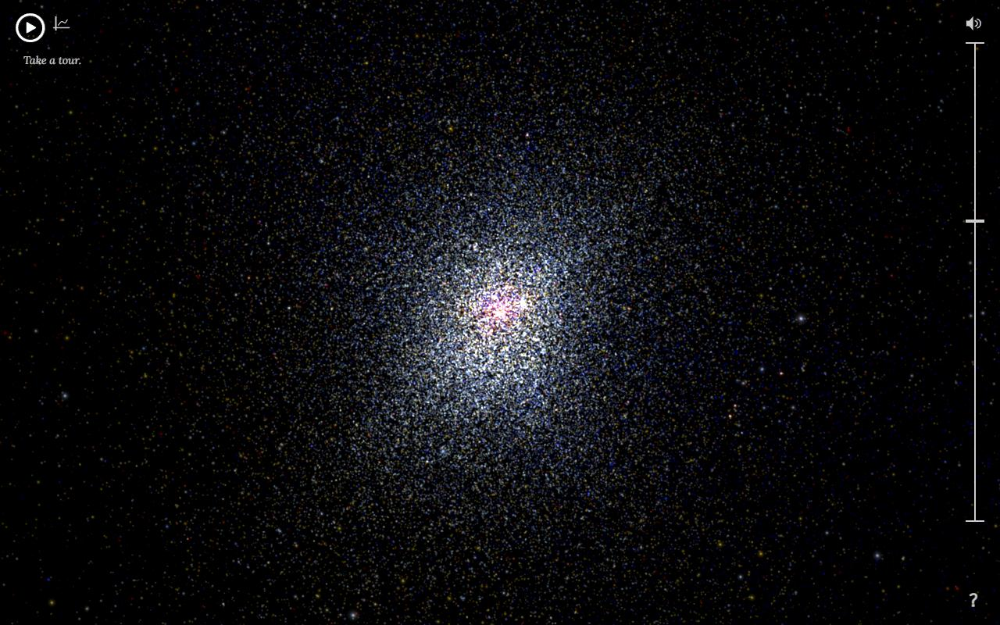
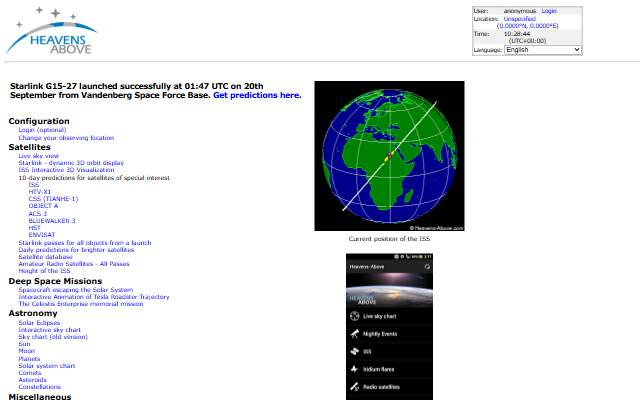
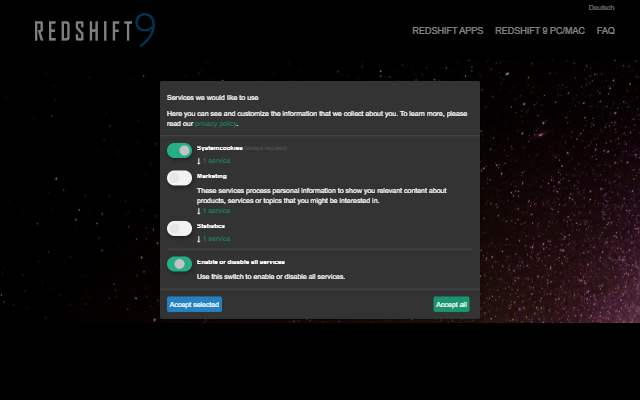
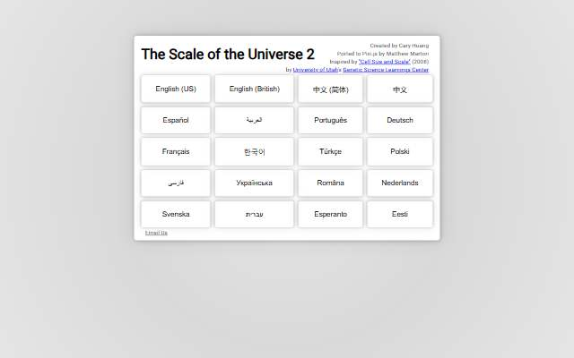

[← All categories](../README.md) · [Text index](index.md) · [About status dates](../README.md#availability)

# Space & Scale

Stars, satellites and visual journeys through the universe.

**8 entries** · Click a preview or title to open the original.

Compact text view · useful on small screens

- [100,000 Stars](<https://stars.chromeexperiments.com/>) — Explore an interactive visualization of our stellar neighborhood. *Visualization · EN · Last available: 2026-09-23*
- [Heavens-Above](<http://heavens-above.com/>) — Find satellite passes and observing information for your location. *Tool · Multilingual · Last available: 2026-09-23*
- [Every Active Satellite](<http://qz.com/296941/interactive-graphic-every-active-satellite-orbiting-earth/>) — A Quartz visual story about satellites orbiting Earth. *Visualization · EN · Not verified yet*
- [ISS Earth Stream](<http://www.ustream.tv/channel/iss-hdev-payload>) — A saved link to the International Space Station's Earth-viewing stream. *Video · EN · Last available: 2026-09-23*
- [LeoLabs](<https://platform.leolabs.space/visualizations/leo#view=originCountry>) — Explore tracked objects in low Earth orbit. *Visualization · EN · Last available: 2026-09-23*
- [Redshift 9](<https://redshiftsky.com/redshift-9/>) — Astronomy and planetarium software for exploring the night sky. *Tool · Multilingual · Last available: 2026-09-23*
- [Stuff in Space](<http://stuffin.space/>) — Explore a three-dimensional view of objects orbiting Earth. *Visualization · EN · Last available: 2026-09-23*
- [The Scale of the Universe 2](<http://htwins.net/scale2/>) — Zoom between the very small and the very large. *Visualization · Multilingual · Last available: 2026-09-23*

<table>
<tr>
<td width="33%" valign="top" align="center">
 
<strong><a href="https://stars.chromeexperiments.com/">100,000 Stars</a></strong> 
Visualization · &nbsp;EN

Explore an interactive visualization of our stellar neighborhood.

🟢 Last available: 2026-09-23
</td>
<td width="33%" valign="top" align="center">
 
<strong><a href="http://heavens-above.com/">Heavens-Above</a></strong> 
Tool · &nbsp;Multilingual

Find satellite passes and observing information for your location.

🟢 Last available: 2026-09-23
</td>
<td width="33%" valign="top" align="center">
 
<strong><a href="http://qz.com/296941/interactive-graphic-every-active-satellite-orbiting-earth/">Every Active Satellite</a></strong> 
Visualization · &nbsp;EN

A Quartz visual story about satellites orbiting Earth.

⚪ Not verified yet
</td>
</tr>
<tr>
<td width="33%" valign="top" align="center">
 
<strong><a href="http://www.ustream.tv/channel/iss-hdev-payload">ISS Earth Stream</a></strong> 
Video · &nbsp;EN

A saved link to the International Space Station&#39;s Earth-viewing stream.

🟢 Last available: 2026-09-23
</td>
<td width="33%" valign="top" align="center">
 
<strong><a href="https://platform.leolabs.space/visualizations/leo#view=originCountry">LeoLabs</a></strong> 
Visualization · &nbsp;EN

Explore tracked objects in low Earth orbit.

🟢 Last available: 2026-09-23
</td>
<td width="33%" valign="top" align="center">
 
<strong><a href="https://redshiftsky.com/redshift-9/">Redshift 9</a></strong> 
Tool · &nbsp;Multilingual

Astronomy and planetarium software for exploring the night sky.

🟢 Last available: 2026-09-23
</td>
</tr>
<tr>
<td width="33%" valign="top" align="center">
 
<strong><a href="http://stuffin.space/">Stuff in Space</a></strong> 
Visualization · &nbsp;EN

Explore a three-dimensional view of objects orbiting Earth.

🟢 Last available: 2026-09-23
</td>
<td width="33%" valign="top" align="center">
 
<strong><a href="http://htwins.net/scale2/">The Scale of the Universe 2</a></strong> 
Visualization · &nbsp;Multilingual

Zoom between the very small and the very large.

🟢 Last available: 2026-09-23
</td>
<td width="33%"></td>
</tr>
</table>

[↑ All categories](../README.md) · [Licensing and third-party notices](../LICENSE.md)
