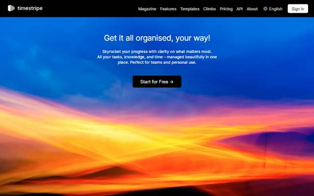
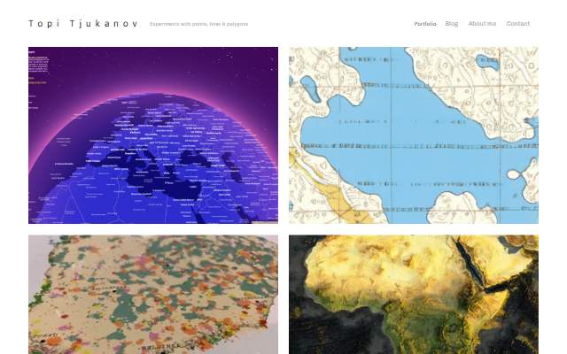
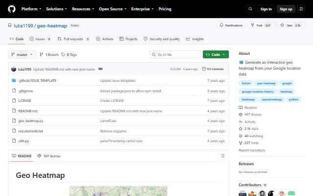
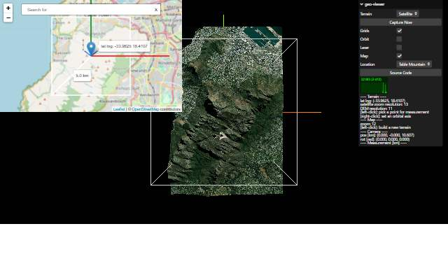

[← All categories](../README.md) · [Text index](index.md) · [About status dates](../README.md#availability)

# Tools & Experiments

Creative tools, network visualizations and cartographic experiments.

**7 entries** · Click a preview or title to open the original.

Compact text view · useful on small screens

- [Timestripe](<http://timestripe.com/>) — A visual planner for goals, projects and time horizons. *Tool · EN · Last available: 2026-09-23*
- [Topi Tjukanov](<https://tjukanov.org/>) — A portfolio of cartographic experiments and visual storytelling. *Collection · EN · Last available: 2026-09-23*
- [Geo Heatmap](<https://github.com/luka1199/geo-heatmap>) — Python and Folium heatmaps for supported location-history exports. *Tool · EN · Last available: 2026-09-23*
- [three-geo](<https://w3reality.github.io/three-geo/examples/geo-viewer/io/>) — A browser-based experiment in three-dimensional terrain visualization. *Tool · EN · Last available: 2026-09-23*
- [Climate Analogues](<https://fitzlab.shinyapps.io/cityapp/>) — Explore places with climates similar to a city's projected future. *Map · EN · Last available: 2026-09-23*
- [GeoSpy](<https://geospy.ai/>) — AI tools for interpreting photographs and their geographic context. *Tool · EN · Last available: 2026-09-23*
- [Cosmograph](<https://cosmograph.app/>) — Explore networks and complex relationships through interactive graphs. *Tool · EN · Last available: 2026-09-23*

<table>
<tr>
<td width="33%" valign="top" align="center">
 
<strong><a href="http://timestripe.com/">Timestripe</a></strong> 
Tool · &nbsp;EN

A visual planner for goals, projects and time horizons.

🟢 Last available: 2026-09-23
</td>
<td width="33%" valign="top" align="center">
 
<strong><a href="https://tjukanov.org/">Topi Tjukanov</a></strong> 
Collection · &nbsp;EN

A portfolio of cartographic experiments and visual storytelling.

🟢 Last available: 2026-09-23
</td>
<td width="33%" valign="top" align="center">
 
<strong><a href="https://github.com/luka1199/geo-heatmap">Geo Heatmap</a></strong> 
Tool · &nbsp;EN

Python and Folium heatmaps for supported location-history exports.

🟢 Last available: 2026-09-23
</td>
</tr>
<tr>
<td width="33%" valign="top" align="center">
 
<strong><a href="https://w3reality.github.io/three-geo/examples/geo-viewer/io/">three-geo</a></strong> 
Tool · &nbsp;EN

A browser-based experiment in three-dimensional terrain visualization.

🟢 Last available: 2026-09-23
</td>
<td width="33%" valign="top" align="center">
 
<strong><a href="https://fitzlab.shinyapps.io/cityapp/">Climate Analogues</a></strong> 
Map · &nbsp;EN

Explore places with climates similar to a city&#39;s projected future.

🟢 Last available: 2026-09-23
</td>
<td width="33%" valign="top" align="center">
 
<strong><a href="https://geospy.ai/">GeoSpy</a></strong> 
Tool · &nbsp;EN

AI tools for interpreting photographs and their geographic context.

🟢 Last available: 2026-09-23
</td>
</tr>
<tr>
<td width="33%" valign="top" align="center">
 
<strong><a href="https://cosmograph.app/">Cosmograph</a></strong> 
Tool · &nbsp;EN

Explore networks and complex relationships through interactive graphs.

🟢 Last available: 2026-09-23
</td>
<td width="33%"></td>
<td width="33%"></td>
</tr>
</table>

[↑ All categories](../README.md)
