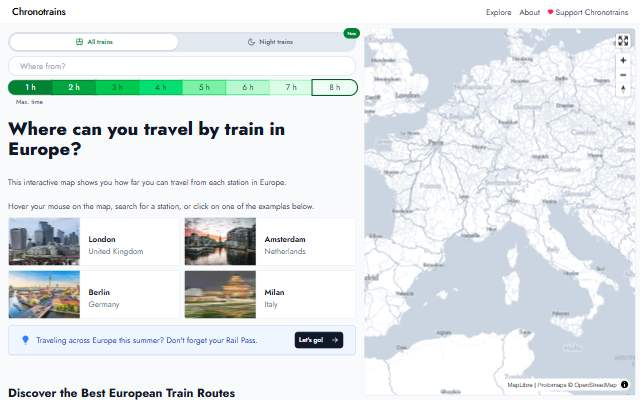
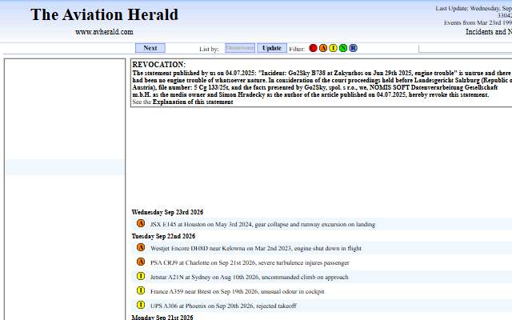
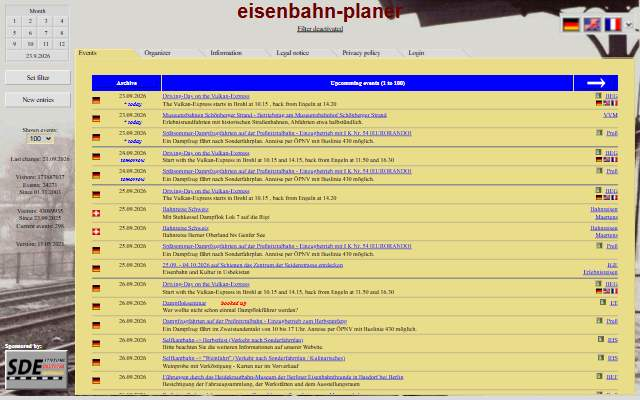
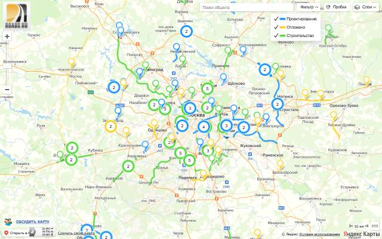
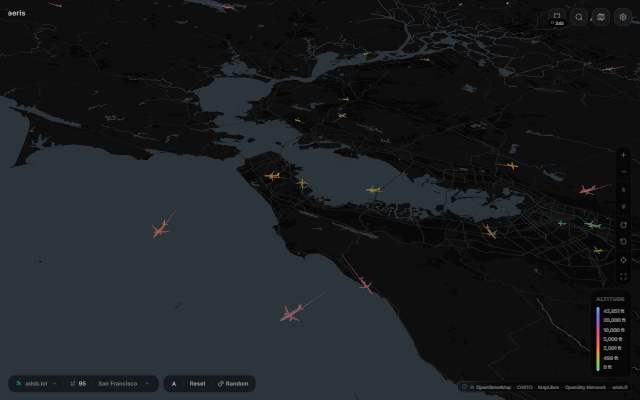
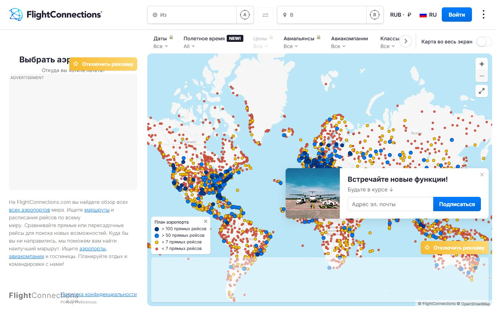

[← All categories](../README.md) · [Text index](index.md) · [About status dates](../README.md#availability)

# Transport & Mobility

Aircraft, ships, trains and the infrastructure connecting the world.

**11 entries** · Click a preview or title to open the original.

Compact text view · useful on small screens

- [Flightradar24](<http://www.flightradar24.com/>) — Follow aircraft around the world on a live flight map. *Map · Multilingual · Not verified yet*
- [Chronotrains · Original App](<https://chronotrains-eu.vercel.app/>) — Explore how far you can travel by train from European stations. *Map · EN · Last available: 2026-09-23*
- [MarineTraffic](<http://www.marinetraffic.com/ru/ais/home/>) — Explore ship positions, ports and maritime traffic. *Map · Multilingual · Not verified yet*
- [The Aviation Herald](<http://avherald.com/>) — Aviation incident reports and operational news. *Collection · EN · Last available: 2026-09-23*
- [Moscow Metro in 3D](<https://varf.ru/metro3d/>) — A three-dimensional model of the Moscow Metro network. *Visualization · RU · Not verified yet*
- [Railway Planner](<http://railway-planner.net/?evlang=en>) — A railway-planning tool from the saved Eisenbahn-Planer project. *Tool · Multilingual · Last available: 2026-09-23*
- [Metro2 · Moscow](<https://metro2.org/msk>) — An interactive view of Moscow's metro system. *Map · RU · Last available: 2026-09-23*
- [Scenic Train Journeys](<https://theculturetrip.com/europe/germany/articles/the-most-scenic-train-journeys-in-germany/>) — An illustrated guide to scenic railway journeys in Germany. *Article · EN · Not verified yet*
- [Road Construction in Russia](<https://www.roads.ru/map-index/>) — Maps of road projects, junctions and infrastructure works. *Map · RU · Last available: 2026-09-23*
- [Aeris](<https://aeris.edbn.me/>) — Watch aircraft move through a real-time 3D flight visualization. *Visualization · EN · Last available: 2026-09-23*
- [FlightConnections](<https://www.flightconnections.com/ru>) — Explore airline routes and connections around the world. *Map · Multilingual · Last available: 2026-09-23*

<table>
<tr>
<td width="33%" valign="top" align="center">
 
<strong><a href="http://www.flightradar24.com/">Flightradar24</a></strong> 
Map · &nbsp;Multilingual

Follow aircraft around the world on a live flight map.

⚪ Not verified yet
</td>
<td width="33%" valign="top" align="center">
 
<strong><a href="https://chronotrains-eu.vercel.app/">Chronotrains · Original App</a></strong> 
Map · &nbsp;EN

Explore how far you can travel by train from European stations.

🟢 Last available: 2026-09-23
</td>
<td width="33%" valign="top" align="center">
 
<strong><a href="http://www.marinetraffic.com/ru/ais/home/">MarineTraffic</a></strong> 
Map · &nbsp;Multilingual

Explore ship positions, ports and maritime traffic.

⚪ Not verified yet
</td>
</tr>
<tr>
<td width="33%" valign="top" align="center">
 
<strong><a href="http://avherald.com/">The Aviation Herald</a></strong> 
Collection · &nbsp;EN

Aviation incident reports and operational news.

🟢 Last available: 2026-09-23
</td>
<td width="33%" valign="top" align="center">
 
<strong><a href="https://varf.ru/metro3d/">Moscow Metro in 3D</a></strong> 
Visualization · &nbsp;RU

A three-dimensional model of the Moscow Metro network.

⚪ Not verified yet
</td>
<td width="33%" valign="top" align="center">
 
<strong><a href="http://railway-planner.net/?evlang=en">Railway Planner</a></strong> 
Tool · &nbsp;Multilingual

A railway-planning tool from the saved Eisenbahn-Planer project.

🟢 Last available: 2026-09-23
</td>
</tr>
<tr>
<td width="33%" valign="top" align="center">
 
<strong><a href="https://metro2.org/msk">Metro2 · Moscow</a></strong> 
Map · &nbsp;RU

An interactive view of Moscow&#39;s metro system.

🟢 Last available: 2026-09-23
</td>
<td width="33%" valign="top" align="center">
 
<strong><a href="https://theculturetrip.com/europe/germany/articles/the-most-scenic-train-journeys-in-germany/">Scenic Train Journeys</a></strong> 
Article · &nbsp;EN

An illustrated guide to scenic railway journeys in Germany.

⚪ Not verified yet
</td>
<td width="33%" valign="top" align="center">
 
<strong><a href="https://www.roads.ru/map-index/">Road Construction in Russia</a></strong> 
Map · &nbsp;RU

Maps of road projects, junctions and infrastructure works.

🟢 Last available: 2026-09-23
</td>
</tr>
<tr>
<td width="33%" valign="top" align="center">
 
<strong><a href="https://aeris.edbn.me/">Aeris</a></strong> 
Visualization · &nbsp;EN

Watch aircraft move through a real-time 3D flight visualization.

🟢 Last available: 2026-09-23
</td>
<td width="33%" valign="top" align="center">
 
<strong><a href="https://www.flightconnections.com/ru">FlightConnections</a></strong> 
Map · &nbsp;Multilingual

Explore airline routes and connections around the world.

🟢 Last available: 2026-09-23
</td>
<td width="33%"></td>
</tr>
</table>

[↑ All categories](../README.md) · [Licensing and third-party notices](../LICENSE.md)
