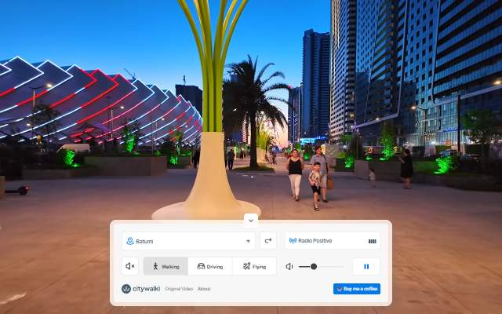
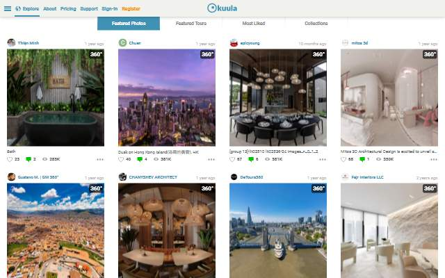
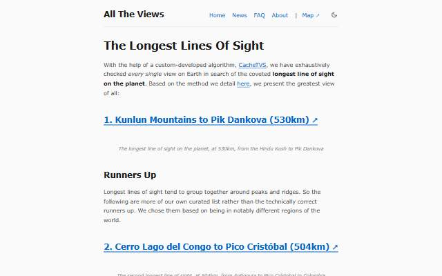

[← All categories](../README.md) · [Text index](index.md) · [About status dates](../README.md#availability)

# Virtual Exploration

Panoramas, city walks, radio stations and windows onto other places.

**5 entries** · Click a preview or title to open the original.

Compact text view · useful on small screens

- [Wonders of Street View](<https://neal.fun/wonders-of-street-view/>) — Discover unusual places captured by street-level panoramas. *Virtual Tour · EN · Not verified yet*
- [Citywalki](<https://www.citywalki.com/>) — Take virtual walking tours through cities around the world. *Virtual Tour · EN · Last available: 2026-09-23*
- [Radio Garden](<https://radio.garden/>) — Explore the globe by listening to local radio stations. *Map · EN · Last available: 2026-09-23*
- [Kuula](<https://kuula.co/explore>) — Browse immersive 360-degree panoramas and virtual tours. *Virtual Tour · EN · Last available: 2026-09-23*
- [All The Views](<https://alltheviews.world/>) — Explore a collection of views and places from around the world. *Virtual Tour · EN · Last available: 2026-09-23*

<table>
<tr>
<td width="33%" valign="top" align="center">
 
<strong><a href="https://neal.fun/wonders-of-street-view/">Wonders of Street View</a></strong> 
Virtual Tour · &nbsp;EN

Discover unusual places captured by street-level panoramas.

⚪ Not verified yet
</td>
<td width="33%" valign="top" align="center">
 
<strong><a href="https://www.citywalki.com/">Citywalki</a></strong> 
Virtual Tour · &nbsp;EN

Take virtual walking tours through cities around the world.

🟢 Last available: 2026-09-23
</td>
<td width="33%" valign="top" align="center">
 
<strong><a href="https://radio.garden/">Radio Garden</a></strong> 
Map · &nbsp;EN

Explore the globe by listening to local radio stations.

🟢 Last available: 2026-09-23
</td>
</tr>
<tr>
<td width="33%" valign="top" align="center">
 
<strong><a href="https://kuula.co/explore">Kuula</a></strong> 
Virtual Tour · &nbsp;EN

Browse immersive 360-degree panoramas and virtual tours.

🟢 Last available: 2026-09-23
</td>
<td width="33%" valign="top" align="center">
 
<strong><a href="https://alltheviews.world/">All The Views</a></strong> 
Virtual Tour · &nbsp;EN

Explore a collection of views and places from around the world.

🟢 Last available: 2026-09-23
</td>
<td width="33%"></td>
</tr>
</table>

[↑ All categories](../README.md)
