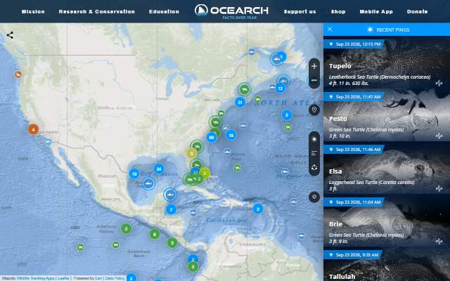
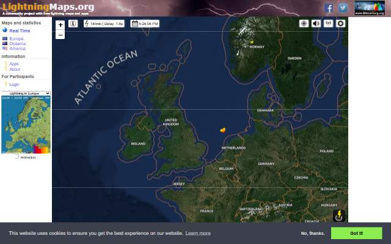
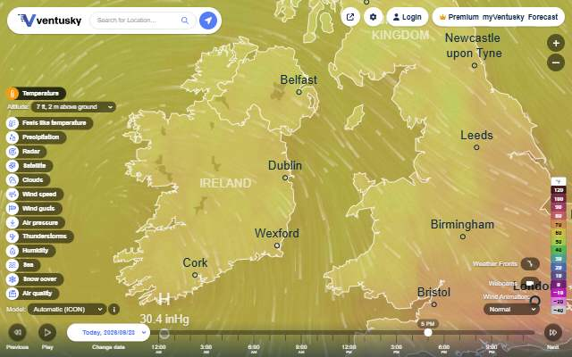

[← All categories](../README.md) · [Text index](index.md) · [About status dates](../README.md#availability)

# Nature & Weather

Weather, wildlife, air quality and the changing natural world.

**6 entries** · Click a preview or title to open the original.

Compact text view · useful on small screens

- [OCEARCH Shark Tracker](<https://www.ocearch.org/tracker/>) — Follow tagged sharks and other marine animals. *Map · EN · Last available: 2026-09-23*
- [AirVisual Earth](<https://www.iqair.com/earth?nav>) — Explore air pollution on an interactive three-dimensional globe. *Map · Multilingual · Not verified yet*
- [Earth Wind Map](<http://earth.nullschool.net/>) — Explore animated wind, ocean and weather patterns on a globe. *Map · Multilingual · Last available: 2026-09-23*
- [LightningMaps](<https://www.lightningmaps.org/>) — Watch lightning activity around the world. *Map · Multilingual · Last available: 2026-09-23*
- [Ventusky](<https://www.ventusky.com/>) — Explore animated weather forecasts and atmospheric conditions. *Map · Multilingual · Last available: 2026-09-23*
- [ShadeMap](<https://shademap.app/>) — Simulate shadows cast by buildings, trees and terrain. *Map · EN · Last available: 2026-09-23*

<table>
<tr>
<td width="33%" valign="top" align="center">
 
<strong><a href="https://www.ocearch.org/tracker/">OCEARCH Shark Tracker</a></strong> 
Map · &nbsp;EN

Follow tagged sharks and other marine animals.

🟢 Last available: 2026-09-23
</td>
<td width="33%" valign="top" align="center">
 
<strong><a href="https://www.iqair.com/earth?nav">AirVisual Earth</a></strong> 
Map · &nbsp;Multilingual

Explore air pollution on an interactive three-dimensional globe.

⚪ Not verified yet
</td>
<td width="33%" valign="top" align="center">
 
<strong><a href="http://earth.nullschool.net/">Earth Wind Map</a></strong> 
Map · &nbsp;Multilingual

Explore animated wind, ocean and weather patterns on a globe.

🟢 Last available: 2026-09-23
</td>
</tr>
<tr>
<td width="33%" valign="top" align="center">
 
<strong><a href="https://www.lightningmaps.org/">LightningMaps</a></strong> 
Map · &nbsp;Multilingual

Watch lightning activity around the world.

🟢 Last available: 2026-09-23
</td>
<td width="33%" valign="top" align="center">
 
<strong><a href="https://www.ventusky.com/">Ventusky</a></strong> 
Map · &nbsp;Multilingual

Explore animated weather forecasts and atmospheric conditions.

🟢 Last available: 2026-09-23
</td>
<td width="33%" valign="top" align="center">
 
<strong><a href="https://shademap.app/">ShadeMap</a></strong> 
Map · &nbsp;EN

Simulate shadows cast by buildings, trees and terrain.

🟢 Last available: 2026-09-23
</td>
</tr>
</table>

[↑ All categories](../README.md)
